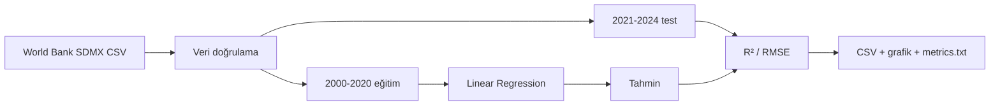

# Türkiye Ekonomik Göstergeler Tahmini

Türkiye'nin kişi başına düşen gelir ve işsizlik oranı verilerini zaman sırasını koruyarak inceleyen, doğrusal regresyonla temel bir tahmin karşılaştırması üreten makine öğrenmesi çalışmasıdır.

> Bu proje eğitim ve portföy amaçlıdır. Sonuçlar ekonomik veya finansal tavsiye değildir.

## Kapsam

- Ülke: Türkiye (`TUR`)
- Veri kaynağı: World Bank Open Data, SDMX CSV
- Göstergeler: kişi başına gelir ve toplam işsizlik oranı
- Eğitim dönemi: 2000–2020
- Test dönemi: 2021–2024
- Model: basit doğrusal regresyon
- Metrikler: R² ve RMSE

Eğitim ve test dönemleri birbirinden tamamen ayrıdır. Böylece aynı yılın hem model eğitiminde hem de performans ölçümünde kullanılması engellenir ve zaman sırasına uygun bir değerlendirme yapılır.

## Deney akışı



## Kurulum ve çalıştırma

Python 3.10 veya üzeri önerilir.

```bash
python -m venv .venv
```

Windows:

```powershell
.venv\Scripts\activate
pip install -r requirements.txt
python linear_regression_forecast.py
```

Linux/macOS:

```bash
source .venv/bin/activate
pip install -r requirements.txt
python linear_regression_forecast.py
```

Program `data/` altındaki tüm CSV dosyalarını işler ve sonuçları `output/` klasörüne yazar.

## Proje yapısı

```text
.
├── data/                              # World Bank SDMX CSV verileri
├── output/                            # Grafik, tahmin ve metrik çıktıları
├── linear_regression_forecast.py      # Veri hazırlama, model ve görselleştirme
├── requirements.txt                   # Python bağımlılıkları
└── README.md
```

## Üretilen çıktılar

Her gösterge için `*_predictions.csv`, `*_forecast.png` ve `metrics.txt` çıktıları üretilir.

## Son test sonuçları

| Gösterge | R² | RMSE |
|---|---:|---:|
| Kişi başına gelir | 0.147471 | 2058.823576 |
| İşsizlik oranı | -3.472065 | 2.768387 |

Negatif R², doğrusal modelin ilgili test döneminde yalnızca ortalama değeri kullanan temel yaklaşımdan daha zayıf kaldığını gösterir. Sonuçlar saklanmamış veya olduğundan iyi gösterilmemiştir; amaç modelin hangi koşullarda yetersiz kaldığını da görünür kılmaktır.

## Yöntem

Model yalnızca yılı bağımsız değişken olarak kullanır:

$$
y = \beta_0 + \beta_1 x
$$

Kod SDMX verisini doğrular, yıl ve gözlem değerlerini sayısallaştırır, modeli 2000–2020 döneminde eğitir, 2021–2024 dönemini tahmin eder ve metrik/grafik çıktılarını yeniden üretir.

## Sonuçların yorumu

Bu çalışma, yüksek bir metrik üretmekten çok zaman sıralı değerlendirme ve model sınırlılıklarını doğru yorumlama üzerine kuruludur. Özellikle dört yıllık test döneminin küçük olması ve yalnızca `year` değişkeninin kullanılması, ekonomik serilerdeki yapısal kırılmaları açıklamak için yetersizdir.

## Sınırlılıklar ve geliştirme alanları

- Tek açıklayıcı değişken olarak yıl kullanıldığı için ekonomik dinamikler bütünüyle temsil edilmez.
- Krizler, politika değişiklikleri ve yapısal kırılmalar doğrusal modelde ayrıca ele alınmaz.
- Test dönemi dört gözlemden oluştuğu için metrikler oynaktır.
- Gelecek çalışmalarda enflasyon, büyüme ve işgücüne katılım gibi değişkenler eklenebilir.
- Zaman serisi çapraz doğrulaması uygulanabilir.
- Linear Regression; ARIMA/SARIMA ve ağaç tabanlı modellerle aynı zaman bölünmesinde karşılaştırılabilir.

Çalışma, Birleşmiş Milletler Sürdürülebilir Kalkınma Amaçları içindeki **SKA 8: İnsana Yakışır İş ve Ekonomik Büyüme** bağlamında temel bir veri analizi örneği olarak hazırlanmıştır.
